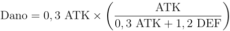
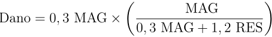
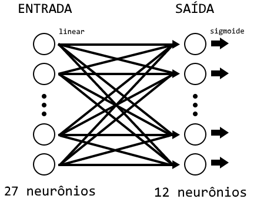
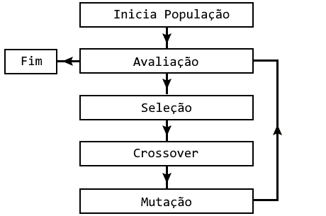
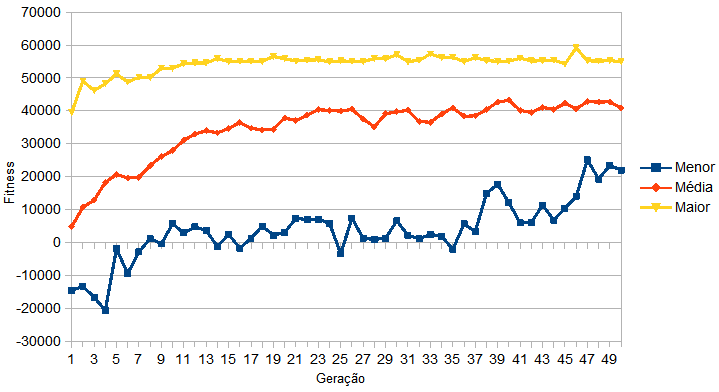
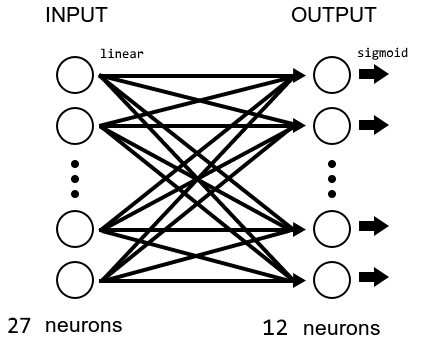
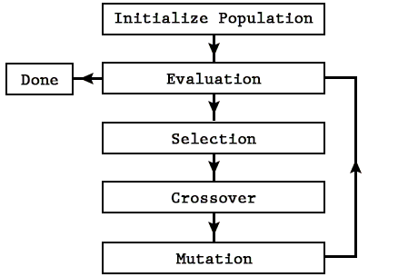
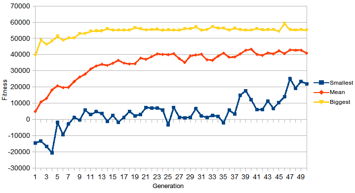

# Idiomas | Languages | 言語
- [Português](#Índice)
- [English](#index)
- [日本語](#目次)

---

# Índice
1. [Sobre o jogo](#sobre-o-jogo)
2. [Sobre a IA](#sobre-a-ia)
3. [Resultados](#resultados)
4. [Vídeo](#vídeo)

# Sobre o jogo
Para a explicação completa, [clique aqui](https://github.com/mateus-etto/Monografia-IAJogoRPG/releases) para ler a monografia.

Neste projeto foi criado uma Inteligência Artificial que controla personagens de um jogo RPG em turnos.
O objetivo é que os personagens sejam capazes de derrotar o time inimigo o quanto antes.

## Atributos
Cada personagem do jogo foi implementado com os seguintes atributos:

**HP (Pontos de Vida):**
É o quanto de dano o personagem pode receber antes de ser incapacitado.

**MP (Pontos de Magia):**
É consumido ao utilizar habilidades.

**ATK (Ataque):**
Um valor alto de ataque permite infligir maiores danos físicos.

**DEF (Defesa):**
Um valor alto de defesa reduz os danos físicos que serão infligidos no HP.

**MAG (Magia):**
Equivalente ao ATK, mas infligindo danos mágicos.

**RES (Resistência):**
Equivalente ao DEF, mas reduzindo danos mágicos que serão infligidos no HP.

**SPD (Velocidade):**
Velocidade do personagem, e valores altos o permite executar mais comandos em menos tempo.

## Tipos de danos
Existem dois tipos de danos, o físico e o mágico.
Danos mágicos são elementais, sendo:
água, fogo, terra e vento.
Cada personagem pode ser fraco, neutro ou forte em relação em algum tipo de dano.

## Cálculos de danos
O dano físico é calculado pela seguinte fórmula:

O dano mágico é calculado pela seguinte fórmula:

## Comandos
Quando um personagem recebe um turno,
ele pode escolher um entre 4 comandos básicos:
Atacar, Defender, Usar Habilidade e Usar Item.

**Ataque** é o comando ofensivo mais simples de todos.
Não consome MP, e causa dano físico razoavelmente baixo.

**Defesa** é um comando defensivo que reduz o dano a ser recebido.
Após todos os cálculos de dano, é verificado se o personagem está defendendo.
Se estiver, aquele dano é reduzido em 50%.

**Habilidade** é um comando que possui 3 subcomandos,
cada um deles representando uma habilidade diferente:
- **Habilidade Fraca** é uma habilidade que pode causar tanto dano físico quanto mágico,
consome 50 MP, e após os cálculos de dano, o valor de dano é aumentado em 50%.
- **Habilidade Forte** é semelhante a fraca, consome 110 MP, e causa um aumento de dano de 100%.
- **Habilidade de Cura** é uma habilidade que permite recuperar o HP de algum personagem.
Por ser uma habilidade de suporte, a RES do alvo é ignorada, sendo aplicada uma cura equivalente a 50% do MAG do personagem que está aplicando a cura.

**Item** é um comando que permite o uso de itens consumíveis durante a batalha.
Existem 6 itens diferentes, um é Poção e os outros 5 são ofensivos, um para cada tipo de dano existente no jogo.
A poção tem valor constante de cura, e os outros tem um valor de "ataque" semelhante a ATK ou MAG, que é independente do personagem que irá usá-lo.

## Atributos dos personagens
| Parâmetro  | Tanker | Guerreiro | Mago |
| :---: | :---: | :---: | :---: |
| **HP Max** | 750 | 500 | 400 |
| **MP Max** | 350 | 550 | 800 |
| **ATK** | 250 | 475 | 200 |
| **DEF** | 500 | 425 | 215 |
| **MAG** | 200 | 250 | 510 |
| **RES** | 400 | 210 | 450 |
| **SPD** | 82 | 98 | 79 |
| **Defesa Física** | Alta | Alta | Normal |
| **Defesa de Água** | Normal | Baixa | Alta |
| **Defesa de Fogo** | Alta | Normal | Normal |
| **Defesa de Terra** | Normal | Normal | Alta |
| **Defesa de Vento** | Alta | Normal | Alta |
| **Hab. Fraca** | Terra | Física | Água |
| **Hab. Forte** | Física | Fogo | Vento |

# Sobre a IA
A IA foi feita com conceitos de Redes Neurais Artificiais e Algoritmo Genético.
Durante o jogo, cada equipe possui uma Inteligência Artificial que simboliza o jogador que os controla.

## Rede neural implementada
A Rede Neural Artificial implementada possui 27 neurônios na camada de entrada e 12 neurônios na camada de saída.
A RNA é responsável pela decisão de quem será o alvo do personagem que recebeu o turno.

Nos neurônios da camada de entrada, são usados os atributos ofensivos do atacante,
todos os atributos do possível alvo
e algumas informações de contexto, como se o alvo é inimigo e se ele está se defendendo.

Na camada de saída, tem-se o resultado da probabilidade daquele personagem se tornar alvo e a probabilidade de cada comando.

## Algoritmo Genético
O algoritmo genético utilizado para treinar a RNA possui 40 indivíduos,
sendo que cada um possui a matriz de pesos da RNA de uma equipe.
O ciclo do algorítmo desenvolvido é:

Durante a avaliação, o comando do personagem é avaliado e resulta em uma nota.
Um comando executado corretamente, ou seja, ataque em inimigo ou cura em aliado, resulta em nota positiva.
Um comando executado incorretamente, ou seja, ataque em aliado ou cura em inimigo, resulta em nota negativa.
Em todos os comandos este valor é somado ao fitness da equipe.

Os valores de fitness quando a batalha acaba são eventualmente usados na seleção,
tendo maior probabilidade de ser selecionado com um maior fitness.

E então através do crossover e mutação é criado uma população melhorada, com um desempenho melhor para batalhar e derrotar a equipe inimiga.

# Resultados
Após um treinamento de 50 gerações da Inteligência Artificial,
percebeu-se que os personagens aprenderam a melhorar sua performance com sucesso,
e com melhoras significativas nas primeiras gerações.

# Vídeo

---

# Index
1. [About the game](#about-the-game)
2. [About the AI](#about-the-ai)
3. [Results](#results)
4. [Video](#video)

# About the game
For the complete explanation, [click here](https://github.com/mateus-etto/Monografia-IAJogoRPG/releases) to read the monograph (in Portuguese).

In this project was created an Artificial Intelligence that controls characters in a turn-based RPG game.
The objective is to train the characters so they are able to defeat enemy team as soon as possible.

## Attributes
Each character in the game was implemented with the following attributes:

**HP (Health Points):**
It's how much damage the character can take before being incapacitated.

**MP (Magic Points):**
It is consumed when using skills.

**ATK (Attack):**
A high attack value allows to inflict greater physical damage.

**DEF (Defense):**
A high defense value reduces the physical damage that will be inflicted on HP.

**MAG (Magic):**
Equivalent to ATK, but inflicting magical damage.

**RES (Resistance):**
Equivalent to DEF, but reducing magic damage that will be inflicted on HP.

**SPD (Speed):**
High values of speed allows to execute more commands in less time.

## Types of damage
There are two types of damage, the physical and the magical.
Magic damages are elementals, being:
water, fire, earth and wind.
Each character can be weak, neutral or strong to some type of damage.

## Damage calculations
The physical damage is calculated by the following formula:

Magic damage is calculated by the following formula:

## Commands
When a character receives a turn,
it can choose one of 4 basic commands:
Attack, Defend, Use Skill and Use Item.

**Attack** is the simplest offensive command of all.
It does not consume MP, and it causes a low physical damage.

**Defend** is a defensive command that reduces damage to be taken.
After all damage calculations, it is checked whether the character is defending.
If it is, the damage is reduced by 50%.

**Skill** is a command that has 3 subcommands,
each one representing a different skill:
- **Weak Skill** is an ability that can cause both physical and magical damage,
consumes 50 MP, and after damage calculations, the damage value is increased by 50%.
- **Strong Skill** is similar to the weak skill, but it consumes 110 MP and causes a 100% damage increase.
- **Healing Skill** is a skill that allows to recover the HP of the target.
Because it is a supporting ability, target RES is ignored, and a healing value equivalent to 50% of the MAG from the character using the skill is applied.

**Item** is a command that allows using consumable items during battle.
There are 6 different items, one is Potion and the other 5 are offensive, one for each type of damage in the game.
The potion has a constant healing value, and the others have an attack value similar to ATK or MAG.

## Characters Attributes
| Parameter  | Tanker | Warrior | Mage |
| :---: | :---: | :---: | :---: |
| **HP Max** | 750 | 500 | 400 |
| **MP Max** | 350 | 550 | 800 |
| **ATK** | 250 | 475 | 200 |
| **DEF** | 500 | 425 | 215 |
| **MAG** | 200 | 250 | 510 |
| **RES** | 400 | 210 | 450 |
| **SPD** | 82 | 98 | 79 |
| **Physical Defense** | High | High | Normal |
| **Water Defense** | Normal | Low | High |
| **Fire Defense** | High | Normal | Normal |
| **Earth Defense** | Normal | Normal | High |
| **Wind Defense** | High | Normal | High |
| **Weak Skill** | Earth | Physical | Water |
| **Strong Skill** | Physical | Fire | Wind |

# About the AI
The AI was done using concepts of Artificial Neural Networks and Genetic Algorithm.
During the game, each team has an Artificial Intelligence that symbolizes the player who controls them.

## Neural network implemented
The implemented Artificial Neural Network (ANN) has 27 neurons in the input layer and 12 neurons in the output layer.
The ANN is responsible for deciding who will be the target of the character that received the turn.

In the neurons of the input layer, the offensive attributes of the attacker,
all attributes of the possible target
and some context information, as if the target is an enemy and if he is defending himself, are used.

In the output layer, the result is the priority that the character will become the target and the priority to use each command.

## Genetic Algorithm
The genetic algorithm used to train the ANN has 40 individuals,
each one has the matrix of ANN weights of a team.
The flow of the algorithm developed is:

During the evaluation, the character's command is evaluated and results in a score.
A command executed correctly, ie enemy attack or ally heal, results in a positive score.
A command executed incorrectly, ie ally attack or enemy heal, results in a negative score.
After all commands, this score is added to the team's fitness.

The fitness values when the battle ends are eventually used in the selection phase,
and those with greater fitness are more likely to be selected.

And then, through the crossover and mutation, an improved population is created, with better performance to battle and defeat the enemy team.

# Results
After training the Artificial Intelligence during 50 generations,
it was noticed that the characters learned to improve their performance with success,
and with significant improvements in the early generations.

# Video

---

# 目次
1. [ゲームについて](#ゲームについて)
2. [人工知能について](#人工知能について)
3. [結果](#結果)
4. [ビデオ](#ビデオ)

# ゲームについて
完全な説明については[ここにクリックして](https://github.com/mateus-etto/Monografia-IAJogoRPG/releases)、学術論文が読めます（ポルトガル語）。

このプロジェクトでは、ターン性RPGゲームでキャラクターをコントロールする人工知能が作成されました。
目的はできるだけ早く敵チームを倒すことです。その為、キャラクターは訓練します。

## 属性
ゲームの各キャラクターは次の属性で実装されました：

**HP (体力):**
キャラクターが気絶するまでどれくらいのダメージが受けられます。

**MP (魔力):**
スキルを使用するときに消費されます。

**ATK (攻撃力):**
攻撃力が高いほど、物理的なダメージが大きくなります。

**DEF (防御力):**
高い防御力は、HPに与えられる物理的なダメージを軽減します。

**MAG (魔法力):**
ATKに等しいが、魔法のダメージを与える。

**RES (抵抗力):**
DEFと同等ですが、HPに与えられる魔法のダメージを軽減します。

**SPD (速度):**
速度の値が高いと、より短い時間でより多くのコマンドを実行出来ます。

## ダメージの種類
物理と魔法の2種類のダメージがあります。
魔法のダメージは水、火、土、風のタイプがあります。
それぞれのキャラクターは、弱い、中立的、または強いタイプのダメージに抵抗を持っています。

## ダメージ計算
物理的ダメージは次の式で計算されます：

魔法ダメージは次の式で計算されます：

## コマンド
キャラクターがターンを受信すると、
4つの基本コマンドのうち、1つを選択出来ます：
攻撃、防御、スキル、アイテムです。

**攻撃**
は最も簡単なコマンドです。
MPを消費せず、少し物理的なダメージを与えます。

**防御**
は受けるダメージを減らすコマンドです。
ダメージ計算後、キャラクターが防御しているかどうかがチェックされます。
防御している場合、ダメージは50％軽減します。

**スキル**
は3つのサブコマンドを持つコマンドです。
- **弱いスキル**
は物理的および魔法的なダメージの両方を引き起こす可能性のある能力であり、
50 MPを消費し、ダメージ計算後にダメージ値が50％増加します。
- **強いスキル**
は弱いスキルに似ていますが、110 MPを消費し、100％ダメージを増加させます。
- **ヒーリングスキル**
はターゲットのHPを回復させるスキルです。
支援スキルであるため、ターゲットのRESは無視され、スキルを使用するキャラクタは50％のMAGから治癒します。

**アイテム**
は戦闘中に消耗アイテムを使用できるようにするコマンドです。
6つのアイテムがあります。1つは回復薬、他の5つは攻撃的で、それぞれゲームに存在するタイプのダメージです。
回復薬は一定の治癒値を持ち、他のものは攻撃がATKまたはMAGの値に似ています。

## キャラクターの属性
| 属性  | タンカー | 戦士 | 魔道士 |
| :---: | :---: | :---: | :---: |
| **HP Max** | 750 | 500 | 400 |
| **MP Max** | 350 | 550 | 800 |
| **ATK** | 250 | 475 | 200 |
| **DEF** | 500 | 425 | 215 |
| **MAG** | 200 | 250 | 510 |
| **RES** | 400 | 210 | 450 |
| **SPD** | 82 | 98 | 79 |
| **物理防御力** | 高 | 高 | 中 |
| **水の防御力** | 中 | 低 | 高 |
| **火の防御力** | 高 | 中 | 中 |
| **土の防御力** | 中 | 中 | 高 |
| **風の防御力** | 高 | 中 | 高 |
| **弱いスキル** | 土 | 物理 | 水 |
| **強いスキル** | 物理 | 火 | 風 |

# 人工知能について
人工知能はニューラルネットワークと遺伝的アルゴリズムの概念が使われました。
ゲーム中、各チームは制御する人工知能があり、それらはプレイヤーを象徴します。

## ニューラルネットワークの実装
実装されたニューラルネットワークは、入力層に27個のニューロンを有し、出力層に12個のニューロンを有します。
ニューラルネットワークは、ターンを受け取ったキャラクターの標的となる人物を決定する責任があります。

入力層のニューロンでは、ターンを受け取ったキャラクターの攻撃的な属性、
ターゲットのすべての属性、
標的が敵であるかどうか、標的が防御中かどうか、このようなコンテキスト情報も使用されています。

出力レイヤーでは、結果がキャラクターがターゲットになる優先度と各コマンドを使用する優先度になります。

## 遺伝的アルゴリズム
ニューラルネットワークを訓練するために使用される遺伝的アルゴリズムは40人の個体を有し、
それぞれにチームのニューラルネットワークの重みの行列があります。
開発されたアルゴリズムの流れは次のイメージに表します。

評価中、キャラクターのコマンドが評価され、結果がスコアになります。
正常に実行されたコマンド、すなわち敵に攻撃し、または味方に治療しはポジティブなスコアになります。
誤って実行されたコマンド、すなわち味方に攻撃し、または敵に治療しはネガティブなスコアになります。
コマンドの後、このスコアはチームのフィットネスに追加されます。

戦闘が終了したときのフィットネスは選択段階で使用され、
より大きなフィットネスを有するものが選択される可能性が高くなります。

そして、クロスオーバーと突然変異によって、より良い成績できる人口が産まれます。この新たな人工では前より戦いパフォーマンスが上がります。

# 結果
50代の人工知能を訓練した後、
キャラクター達は戦いパフォーマンスが向上し、
特に初期の世代で大幅な改善が見られました。

# ビデオ

